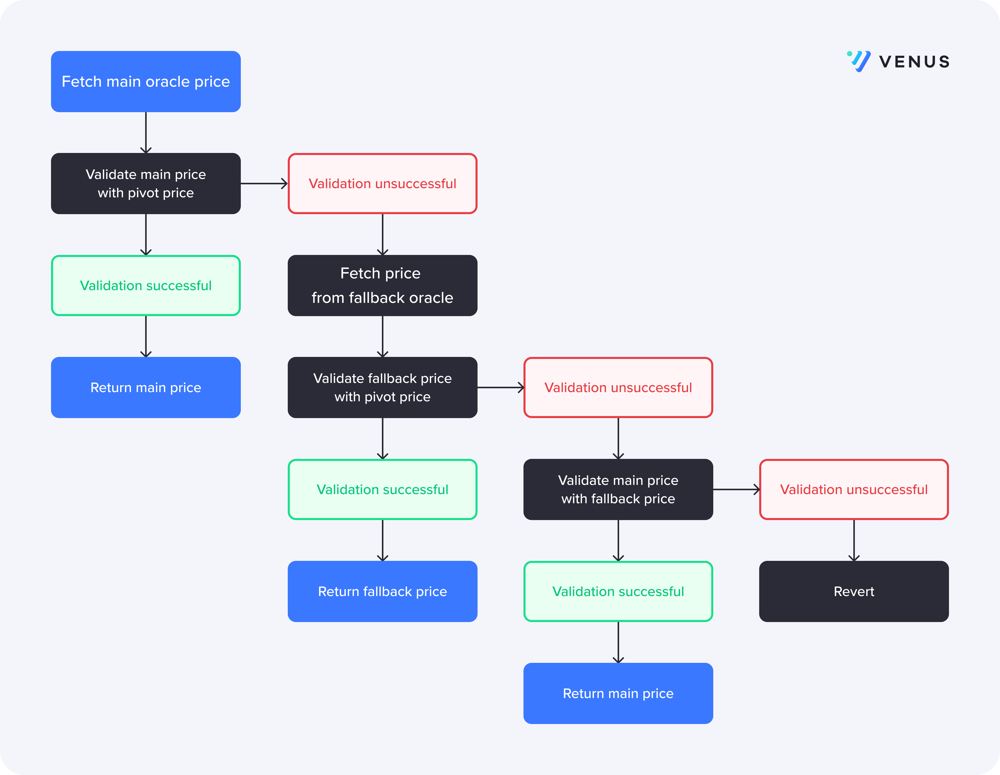

[](https://github.com/VenusProtocol/oracle/actions/workflows/cd.yaml) [](https://github.com/VenusProtocol/oracle/actions/workflows/ci.yml)

# Resilient Price Feeds

Resilient Price Feeds is a set of smart contracts that uses multiple oracles and a price validation algorithm to fetch asset prices for the [Venus Protocol](https://app.venus.io).

DeFi protocols are vulnerable to incorrectly reported prices which can lead to lost money. A price oracle can be manipulated,fail, or suffer other attacks depending on the type of price oracle. It creates a single point of failure, opening attack vectors to the protocol if not mitigated.

The Resilient Price Feeds uses multiple oracle sources and fallback mechanisms to return accurate prices and protect from oracle failures. Currently, it includes integrations with Chainlink, RedStone and Binance Oracle oracles.

## Details

The Resilient Price Feeds configures a main, pivot and fallback oracle for every asset. The main oracle is the most trustworthy price source, the pivot oracle is used as a loose sanity checker and the fallback oracle is used as a backup price source.



Oracle prices are validated using an **upper** and **lower** bound ratio, which is set for every market. The **upper bound ratio** represents the **deviation** between the **reported price** (price from oracle that’s being validated) and anchor price (price from oracle we are validating against) beyond which the reported price will be invalidated. The **lower bound ratio** presents the **deviation** between **reported price and anchor price** below which the reported price will be invalidated. For an oracle price to be considered valid the below statement should be true:

```
anchorRatio = anchorPrice/reporterPrice
isValid = anchorRatio <= upperBoundAnchorRatio && anchorRatio >= lowerBoundAnchorRatio
```

The default configuration uses Chainlink as the main oracle, RedStone oracle as the pivot oracle depending on which supports the given market and Binance oracle as the fallback oracle. For some markets we may use RedStone as the main oracle if the token price is not supported by Chainlink or Binance oracles.

When fetching an oracle price, for the price to be valid it must be positive and not stagnant. If the price is invalid or stagnant it is ignored and a fallback oracle is used.

# Development

## Prerequisites

- NodeJS - 14.x

- Solc - v0.8.13 (https://github.com/ethereum/solidity/releases/tag/v0.8.13)

## Installing

```

yarn install

```

## Linting and code formatting

Linting is done using eslint for typescript and solhint for solidity. Prettier is used to format solidity and typescript files.

To check linting and formatting on all files run:

```sh
$ yarn lint
```

Linting command can be run with the fix flag to fix eligible errors automatically

```sh
$ yarn lint:sol --fix
$ yarn lint:ts --fix
```

To pretty all files run:

```sh
$ yarn prettier
```

## Run Tests

```

npx hardhat test

```

- To run fork tests add FORK=true, FORKED_NETWORK and one ARCHIVE_NODE var in the .env file.

## Releases and Versioning

Releases are automatically managed using semantic-release and commit messages.

## Deployment

```

npx hardhat deploy

```

- This command will execute all the deployment scripts in `./deploy` directory
- The default network will be `hardhat`
- Deployment to another network: - Make sure the desired network is configured in `hardhat.config.ts` - Add `PRIVATE_KEY` variable in `.env` file - Execute deploy command by adding `--network <network_name>` in the deploy command above - E.g. `npx hardhat deploy --network bsctestnet`
- Execution of single or custom set of scripts is possible, if:
  - In the deployment scripts you have added `tags` for example: - `func.tags = ["MockTokens"];`
  - Once this is done, adding `--tags "<tag_name>,<tag_name>..."` to the deployment command will execute only the scripts containing the tags.

### Deployed Contracts

Contract addresses and abis are exported in the `deployments` directory. To create a summary export of all contracts deployed to a network run.

```
$ yarn hardhat export --network <network-name> --export ./deployments/<network-name>.json
```

## Verify Contracts

```
npx hardhat etherscan-verify --network <network-name>
```

## Hardhat Commands

```

npx hardhat accounts

npx hardhat compile

npx hardhat clean

npx hardhat test

npx hardhat node

npx hardhat help

REPORT_GAS=true npx hardhat test

npx hardhat coverage

TS_NODE_FILES=true npx ts-node scripts/deploy.ts

npx eslint '**/*.{js,ts}'

npx eslint '**/*.{js,ts}' --fix

npx prettier '**/*.{json,sol,md}' --check

npx prettier '**/*.{json,sol,md}' --write

npx solhint 'contracts/**/*.sol'

npx solhint 'contracts/**/*.sol' --fix

```

## Documentation

Documentation is autogenerated using [solidity-docgen](https://github.com/OpenZeppelin/solidity-docgen).

They can be generated by running `yarn docgen`
